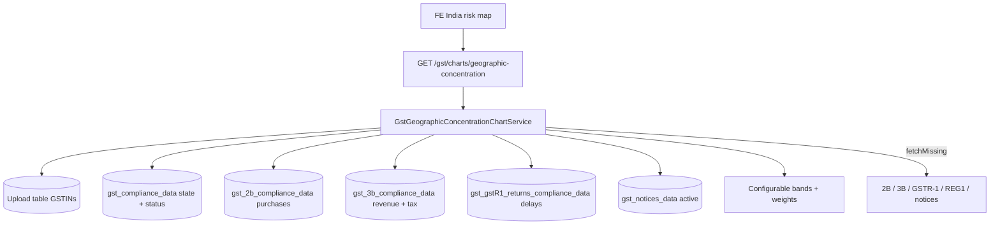

# Geographic Concentration Chart API — Backend Implementation Plan

## Goal

Ship one backend API for the **Geographic Concentration** India map on Company / Loan summary.

The frontend should be able to:

- Colour each state by a **Composite Geographic Risk Score (0–100)** and risk level
- Click a state → **factor table** (raw %, factor risk score, weight, contribution)
- Apply **Past 1 / 3 / 5 years**, **yearly only** (no quarter / half / month)
- Show **missing source data** with Fetch Data / Continue Anyway
- Use the **same logic at PAN and LOAN** level

Source: `Registration status and geographic concentration.docx`, chapter **Geographic Concentration** (this file has no stored page breaks; that chapter is the map/score section that sits after On-Time Filing and before Business Performance — treated as the p.19–28 chart).

**Out of scope here:** Registration Status (already shipped), On-Time Filing Behaviour, Business Performance, vintage KPIs, Basic Details, Business Continuity.

---

## Current state in this repo

| Piece | Status | Reuse |
|-------|--------|--------|
| Chart pattern (PAN/LOAN, range, missing/fetch) | Done | Tax Payment / Legal Risk / Supplier Concentration |
| State of GSTIN | Partial | GSTIN first 2 digits + `gst-pan-search.util` `stateCodeFromGstin`; GSTREG1 `searchResponse` may also have state |
| Purchase taxable value | Done | GSTR-2B `gst-supplier-concentration-chart.util` `extractSupplierPurchases` (sum by **buyer GSTIN**, not supplier) |
| Revenue / tax paid / ITC | Done | GSTR-3B `computePrimaryGstr3bAggregationMetrics` |
| Registration Active/Cancelled/Suspended | Done | Registration Status chart / GSTREG1 |
| Delayed GSTR-1 | Exists | `gst-gstr-track-aggregation.util` delayed return counts |
| Active legal notices | Done | Legal Risk (`gst_notices_data`, active = not closed) |
| Geographic map endpoint | **Not started** | No `/gst/charts/geographic-concentration` |

---

## Product rules (from the doc)

| Rule | Detail |
|------|--------|
| Visual | India map: state, composite score, risk level, colour |
| Click state | Tabular factor breakdown (Figma) |
| Entity | All GSTINs under Company PAN; same for loan |
| Grain | **Yearly only** |
| Range | `1y` \| `3y` \| `5y` (top-right filter, 2nd view) |
| Consolidation | GSTINs in the same state are summed, then compared to company total → % |
| Scoring | % → 0–100 **factor risk score** via bands → **weighted** composite |
| Thresholds / weights | Configurable |
| Missing | NULL, not 0; Fetch Data / Continue Anyway |
| Interpretation | High concentration is **not** risk by itself; only after bands + weights |

### Factors, sources, weights

| Factor | Source | Weight | Role |
|--------|--------|--------|------|
| Tax liability / payment stress | GSTR-3B | 30% | Primary |
| Revenue (turnover) concentration | GSTR-3B taxable turnover | 30% | Primary |
| Delayed filing | GSTR-1 | 15% | Secondary |
| Active legal notices | Notice list (`gst_notices_data`) | 15% | Secondary |
| Purchase concentration | GSTR-2B taxable value | 5% | Supporting |
| GSTIN cancelled / suspended | GSTREG1 | 5% | Supporting |
| **Total** | | **100%** | |

### Raw % (state vs company)

- **Purchase %** = state purchase ÷ company purchase × 100  
- **Revenue %** = state taxable turnover ÷ company taxable turnover × 100  
- **Cancelled GSTIN %** = state cancelled count ÷ **company cancelled count** × 100  
- **Suspended GSTIN %** = state suspended count ÷ **company suspended count** × 100  
- **Tax payment stress % (geo)** = state outstanding tax ÷ company outstanding tax × 100  
- **Delayed filing %** = state delayed exposure ÷ company delayed exposure × 100  
- **Active legal notice %** = state active notices ÷ company active notices × 100  

Underlying tax-payment stress (GSTR-3B, same idea as Tax Payment chart):

- Total liability = IGST+CGST+SGST+CESS on outward supplies  
- Outstanding = total liability − (cash paid + ITC utilised)  
- Unpaid ratio = outstanding ÷ total liability (GSTIN-level diagnostic; **map factor** is the state’s **share of company outstanding**)

### Factor risk bands (configurable)

| Band → score label | Purchase / Revenue / GSTIN count | Tax stress / Delayed / Notices |
|--------------------|----------------------------------|--------------------------------|
| Very Low | 0–10% | 0–5% |
| Low | >10–20% | >5–10% |
| Medium | >20–30% | >10–20% |
| High | >30–40% | >20–30% |
| Very High | >40% | >30% |

Map these labels to numeric **factor scores** 0–100 (see WP0). Doc does not give the numeric points, only labels.

### Composite

```
Composite =
  taxStressScore × 0.30
+ revenueScore     × 0.30
+ delayedScore     × 0.15
+ noticesScore     × 0.15
+ purchaseScore    × 0.05
+ gstinScore       × 0.05
```

Composite colour (also configurable):

| Score | Level |
|-------|--------|
| 0–19 | Very Low |
| 20–39 | Low |
| 40–59 | Medium |
| 60–74 | High |
| 75–100 | Very High |

---

## Open decisions (please confirm)

These are real gaps / contradictions in the Word file. Plan defaults are stated so we can implement after you answer.

1. **State score: share-of-company vs average of GSTIN scores**  
   Sections 4–13: sum GSTIN values → state % of company → score.  
   Later: *“state Score = Average of all valid GSTIN Scores belonging to state”* and *“Need to calculate the average of whole gst within state”*.  
   Those two methods disagree (a large GSTIN would dominate in A, equal vote in B).  
   **Default: method A for the map** (concentration is about share of the company). Optionally also return GSTIN-average as `stateScoreAvg` if product wants both.  
   **Need your call.**

2. **GSTIN 5% factor — cancelled, suspended, or both?**  
   Table shows both %. Weight table has a single “GSTIN Concentration 5%”.  
   Copy-paste bug: Suspended calc says “Number of **Cancelled** GSTINs”.  
   **Default:** compute cancelled % and suspended % separately for the table; for the 5% weight use **max(cancelledScore, suspendedScore)** so the worse registration issue drives the supporting factor.  
   **Need your call:** max vs average vs cancelled-only.

3. **Numeric factor scores**  
   Bands are named Very Low … Very High, not 0/25/50/75/100.  
   **Default:** Very Low=10, Low=30, Medium=50, High=75, Very High=100 (mid-ish of composite colour bands).  
   **Need approved numbers.**

4. **What year does the map show for `range=3y` / `5y`?**  
   Doc: yearly only; filter Past 1/3/5 years. A map is one colour per state.  
   **Default:** composite for the **latest FY in the selected range**; 3y/5y still one map (latest year) plus optional `history[]` of prior FY composites for hover.  
   **Need your call** if they instead want a 3-year **average** of yearly composites.

5. **Delayed filing “exposure”**  
   Not defined (count of delayed GSTR-1, delay-days, or delayed %).  
   **Default:** count of delayed GSTR-1 periods in that FY (`delayedReturnCount` already in track aggregation). State share of that count.

6. **Active legal notice**  
   Reuse Legal Risk: not closed / not resolved; FY from issue date.  
   **Confirm.**

7. **Negative outstanding**  
   If cash+ITC > liability, outstanding = 0 (no stress), not negative.

8. **States with no GSTIN**  
   Omit from `series` (FE shows default grey). Do not emit score 0.

9. **Company denominator 0**  
   e.g. no cancelled GSTINs anywhere → cancelled % `null`, that factor excluded from composite (renormalize remaining weights) **or** treat score as 0.  
   **Default:** factor `null`, **renormalize** weights among factors that have data so a company with zero notices is not punished.  
   **Need your call.**

10. **Loan level**  
    Same as other charts: all GSTINs on the loan (primary + considered). Not “primary company only” (that note is on vintage KPIs, not this chart).

---

## Target API

```
GET /gst/charts/geographic-concentration
```

### Query params

| Param | Required | Values | Role |
|-------|----------|--------|------|
| `entityType` | yes | `PAN` \| `LOAN` | Aggregation |
| `entityId` | yes | PAN or loan id | Entity |
| `range` | yes | `1y` \| `3y` \| `5y` | Year window; map uses **latest FY** (pending Q4) |
| `state` | no | `MH` / `27` / `Maharashtra` | Click state → factor table + GSTIN rows |
| `fetchMissing` | no | `true` | Enqueue missing 2B / 3B / GSTR-1 / REG1 / notices |
| `username` / `tableName` | no | — | Fetch identity / upload table |

### Slim response

```ts
{
  range: '1y' | '3y' | '5y';
  financialYear: string;          // FY used for the map
  series: Array<{                 // one row per state that has ≥1 GSTIN
    stateCode: string;            // "27"
    stateName: string;            // "Maharashtra"
    gstinCount: number;
    compositeScore: number | null;
    riskLevel: 'VERY_LOW' | 'LOW' | 'MEDIUM' | 'HIGH' | 'VERY_HIGH' | null;
    factors: {
      taxStress: FactorCell;
      revenue: FactorCell;
      delayedFiling: FactorCell;
      legalNotices: FactorCell;
      purchase: FactorCell;
      gstinCancelled: FactorCell;
      gstinSuspended: FactorCell;
    };
  }>;
  incomplete: boolean;
  missing: Array<{
    gstin: string;
    source: 'GSTR-2B' | 'GSTR-3B' | 'GSTR-1' | 'GSTREG1' | 'NOTICES';
    financialYear: string;
  }>;
  drilldown?: {
    stateCode: string;
    stateName: string;
    compositeScore: number | null;
    riskLevel: string | null;
    factors: /* same FactorCell map */;
    gstins: Array<{
      gstin: string;
      status: 'ACTIVE' | 'CANCELLED' | 'SUSPENDED' | null;
      purchaseValue: number | null;
      revenue: number | null;
      outstandingTax: number | null;
      delayedReturnCount: number | null;
      activeNoticeCount: number | null;
    }>;
  };
  fetch?: { jobs: Array<{ jobId: string; status: string; checkStatusUrl: string }> };
}

type FactorCell = {
  rawPct: number | null;       // state ÷ company × 100
  riskScore: number | null;    // 0–100
  riskLabel: string | null;
  weight: number;              // 0.30 etc (gstin 5% split TBD)
  contribution: number | null; // riskScore × weight
};
```

**Hard rules**

- Missing source ≠ 0. Flag `incomplete`.
- Empty successful fetch (e.g. 0 notices) is real zero.
- Raw ₹ stay in GSTIN drill-down; map uses %.
- Omit `drilldown` / `fetch` unless requested.
- Configurable bands/weights in one config module (not hardcoded in the controller).

---

## Architecture



### Pipeline

1. Resolve GSTINs (reuse chart entity resolve).
2. Resolve FY window from `range` (same FY calendar as other charts); pick map FY.
3. Map each GSTIN → state (GSTIN prefix, fallback REG1).
4. Load 2B / 3B / GSTR-1 / REG1 / notices for those GSTINs and months in the FY.
5. Roll up each factor to state and company; compute %.
6. Band → factor score → weighted composite; classify risk level.
7. Collect missing GSTIN × source → `incomplete`.
8. Optional `state=` drill-down.
9. Optional fetch jobs per missing source.

---

## Work packages

### WP0 — Confirm questions above + config

- [ ] Freeze method A vs GSTIN-average
- [ ] Freeze GSTIN 5% combination
- [ ] Freeze numeric band → score
- [ ] Freeze map FY vs average-across-range
- [ ] `geographic-risk-config.ts` (bands, weights, labels)

### WP1 — Util + tests

- `gst-geographic-concentration-chart.util.ts`
- `gst-geographic-concentration-chart.util.spec.ts`

- [ ] `stateFromGstin` / name lookup (01–38)
- [ ] `pctShare(state, company)` null-safe
- [ ] `factorScore(pct, bands)`
- [ ] `compositeScore(factorScores, weights, renormalize)`
- [ ] `riskLevel(composite)`
- [ ] Tests: 100% weight sum; missing ≠ 0; 0 company cancelled → null; Maharashtra vs KA split

### WP2 — Service loaders

- [ ] `GstGeographicConcentrationChartService`
- [ ] Reuse 2B purchase extract (by filing GSTIN)
- [ ] Reuse 3B turnover + cash + ITC
- [ ] Reuse REG1 status
- [ ] Reuse delayed GSTR-1 counts
- [ ] Reuse legal-risk flatten + active filter
- [ ] Register in `gst.module.ts`

### WP3 — Controller

- [ ] `GET /gst/charts/geographic-concentration`
- [ ] `successResponse('charts.geographic-concentration', data)`

### WP4 — State drill-down

- [ ] `state=` → factors + GSTIN rows for that state

### WP5 — Missing + fetch

- [ ] `missing[].source` distinguished
- [ ] `fetchMissing=true` queues the right job type per source (not 3B-only)

### WP6 — FE samples

- [ ] Map payload, incomplete, state table, fetch

---

## Suggested build order

1. WP0 answers + config  
2. WP1 util/tests  
3. WP2 + WP3  
4. WP4 drill-down  
5. WP5 fetch  
6. WP6 samples  

---

## Acceptance criteria

- [ ] `GET ...?entityType=PAN&entityId=<PAN>&range=1y` returns `series[]` with `stateCode`, `compositeScore`, `riskLevel`
- [ ] Weights used in composite match the 30/30/15/15/5/5 split (or confirmed variant)
- [ ] Click `state=27` returns factor cells + GSTIN rows only for that state
- [ ] GSTINs with no 3B in the FY do not contribute ₹0 revenue; they appear in `missing`
- [ ] `range=3y` and `5y` remain yearly (no monthly buckets)
- [ ] Same behaviour for `entityType=LOAN`
- [ ] Thresholds/weights live in config, not scattered literals

---

## Risks

1. Unconfirmed A vs B scoring will churn the map colours.  
2. GSTIN 5% ambiguity.  
3. Incomplete months understate a state’s share if treated as zero.  
4. Fetch may need five job types.  
5. Union territories / codes 26–38 mapping must match FE map geojson.

---

## File checklist

| File | Action |
|------|--------|
| `services/gst-geographic-concentration-chart.util.ts` | Create |
| `services/gst-geographic-concentration-chart.util.spec.ts` | Create |
| `services/gst-geographic-concentration-chart.service.ts` | Create |
| `config/geographic-risk-config.ts` | Create |
| `gst.controller.ts` | Add GET |
| `gst.module.ts` | Register service |

---

## Example FE usage

```bash
GET /gst/charts/geographic-concentration?entityType=PAN&entityId=AAACN0255D&range=1y

GET /gst/charts/geographic-concentration?entityType=LOAN&entityId=LN000001&range=3y&state=27

GET /gst/charts/geographic-concentration?entityType=PAN&entityId=AAACN0255D&range=1y&fetchMissing=true&username=analyst1
```
