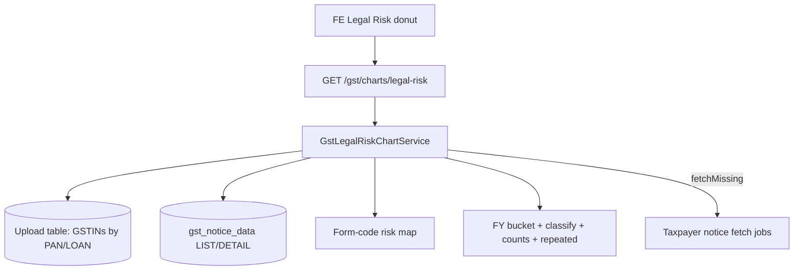

# Legal Risk Donut Chart API — Backend Implementation Plan

## Goal

Ship one backend API for the **Legal Risk** donut (pie) on Company / Loan summary.

The frontend should be able to:

- Show total GST legal notices for the selected **financial year**
- Split them into **High / Medium / Low** risk (centre = total count)
- Open a **notice table** when a slice is clicked
- Show **missing GSTIN notice data** with Fetch Data / Continue Anyway
- Support the same logic at **PAN** and **LOAN** level

Source: `legal and gva.docx` § Legal Risk.

**Out of scope here:** GVA Trend (second half of the same doc).

---

## Current state in this repo

| Piece | Status | Notes |
|-------|--------|--------|
| Tax Payment / Registration chart pattern | Done | Reuse: PAN/LOAN resolve, `range`, missing/fetch, slim response |
| `gst_notice_data` Mongo | Exists | LIST + DETAIL payloads from taxpayer notice APIs |
| Fetch notices | Exists | `POST /gst/taxpayer/notices/fetch` (needs username, gstin, date) |
| Risk mapping file | **Missing** | Doc says “Will share separate file for detailed classification” |
| Chart endpoint | **Not started** | No `/gst/charts/legal-risk` yet |

Stored notice lists are **per GSTIN + query date**, not pre-rolled by FY or risk. The chart must flatten LIST/DETAIL payloads, bucket by **Issue Date FY**, and classify risk from **notice type / form code**.

---

## Product rules (from the doc)

| Rule | Detail |
|------|--------|
| Chart name | Legal Risk (not “Total legal notices on company”) |
| Visual | Donut: Low / Medium / High; centre = total notices |
| Filters on chart | **No quarterly / date picker.** Yearly view only |
| Range | Implicit current FY (and keep prior FYs in backend for trend). Optional `range=1y\|3y\|5y` if FE later needs a year selector — default **current FY** |
| Aggregation | All GSTINs under Company PAN; same for loan |
| Source fields | Notice type, Issue Date, due date of reply (Legal Notice Details) |
| FY assignment | **Issue Date** → Indian FY (Apr–Mar) |
| Risk | From approved mapping (High / Medium / Low) |
| Click slice | Second view: table of notices in that risk |
| Table sort | High → Medium → Low, then latest issue date first |
| Table filters (FE) | Risk, Form Code, Status, Current Status, Issue Date |
| Missing | NULL, not zero notices. Fetch Data / Continue Anyway |
| Loan | Same calculation |

### Interpretation (backend should supply facts; FE can render copy)

Include enough fields for EarlySafe text:

- Total notices, active vs closed
- High-risk active count
- Age of active notices (e.g. overdue vs within due date)
- Current-year vs previous-year count (trend)
- **Repeated notices** in the year (same form code / type on same GSTIN or company) — called out separately
- Do **not** treat every notice as delayed tax payment

Notice families (for interpretation only, not donut slices):

- General compliance
- Demand
- Recovery
- Registration
- Assessment
- Investigation / enforcement
- Refund
- Appeal

Only demand/recovery should feed any “tax-liability payment delay” interpretation later.

---

## Open decisions (WP0)

1. **Risk mapping table** — not in this doc. Need form code / notice type → High | Medium | Low. Until the file arrives, implement a **config map** with a documented placeholder and `UNMAPPED` treated as missing classification (do not dump into Low).
2. **What “open vs closed” is** — list payload may not have a clear status. Confirm field (`status`, `currentStatus`, reply filed, etc.). If absent, derive: overdue if `dueDate < today` and no closure flag.
3. **Notice universe for a FY** — all LIST items whose **issue date** falls in that FY, across all GSTINs. Deduplicate by `gstin + referenceId` (or equivalent).
4. **Missing GSTIN** — a GSTIN has no LIST record covering the FY (no fetch, or empty cache). Empty list after a successful fetch = **0 notices** (real zero). No record at all = **NULL / missing**.
5. **Fetch Data** — reuse taxpayer notice fetch (`GSTIN_VERIFY` is wrong). Chart `fetchMissing=true` should enqueue notice-list fetch per missing GSTIN (needs OTP session). Date param for list API: confirm whether one date returns all outstanding notices or only that day — current API is `date=DD/MM/YYYY`.

---

## Target API (single endpoint)

```
GET /gst/charts/legal-risk
```

Same pattern as Tax Payment / Registration Status: one GET for donut + missing + optional table + fetch.

### Query params

| Param | Required | Values | Role |
|-------|----------|--------|------|
| `entityType` | yes | `PAN` \| `LOAN` | Aggregation |
| `entityId` | yes | PAN or loan id | Entity |
| `financialYear` | no | e.g. `2025-26` | FY for donut; default = current FY |
| `risk` | no | `HIGH` \| `MEDIUM` \| `LOW` | Slice click → table rows |
| `fetchMissing` | no | `true` | Enqueue notice fetch for missing GSTINs |
| `username` / `tableName` | no | — | Fetch identity / upload table |

No `granularity`. No quarter/date filter on this chart.

### Slim response

```ts
{
  financialYear: string;          // "2025-26"
  total: number | null;           // null if no usable notice data at all
  high: number | null;
  medium: number | null;
  low: number | null;
  pctHigh: number | null;
  pctMedium: number | null;
  pctLow: number | null;
  previousYearTotal: number | null;  // trend for interpretation
  interpretation: {
    activeCount: number | null;
    highRiskActiveCount: number | null;
    overdueActiveCount: number | null;
    yoyChange: number | null;        // current total − previous FY total
    repeatedNotices: Array<{
      gstin: string;
      formCode: string | null;
      noticeType: string | null;
      count: number;
    }>;
  };
  incomplete: boolean;
  missing: Array<{
    gstin: string;
    financialYear: string;
  }>;
  drilldown?: {
    financialYear: string;
    risk: 'HIGH' | 'MEDIUM' | 'LOW';
    rows: Array<{
      gstin: string;
      risk: 'HIGH' | 'MEDIUM' | 'LOW';
      formCode: string | null;
      noticeName: string | null;
      purpose: string | null;
      issueDate: string | null;      // ISO date
      dueDate: string | null;
      status: string | null;
      currentStatus: string | null;
      noticeFamily: string | null;   // demand / recovery / ...
      referenceId: string | null;
    }>;
  };
  fetch?: {
    jobs: Array<{
      jobId: string;
      status: string;
      checkStatusUrl: string;
    }>;
  };
}
```

**Hard rules**

- `total = high + medium + low` when all three are numbers.
- `%` = category count ÷ total × 100; three % sum to 100 when total > 0.
- First/empty year: `previousYearTotal` / `yoyChange` stay `null` (no fake 0%).
- Unmapped notice types: exclude from counts **or** list in `missing` as classification gap — prefer exclude from donut and flag `incomplete`.
- Missing GSTIN ≠ 0 notices.
- Omit `drilldown` / `fetch` unless requested.

---

## Architecture



### Pipeline

1. Resolve GSTINs for PAN or LOAN (reuse Tax Payment / Registration resolve).
2. Resolve FY (query or current Indian FY).
3. Load notice LIST (and DETAIL if needed for name/purpose) for those GSTINs.
4. Flatten notices; assign FY from **Issue Date**.
5. Classify risk via mapping; family via type.
6. Count High / Medium / Low; compute % and previous-FY total.
7. Build interpretation facts + repeated-notice groups.
8. Collect GSTINs with no list data → `missing`.
9. Optional: filter rows by `risk` for table.
10. Optional: enqueue notice fetch for missing GSTINs.

---

## Work packages

### WP0 — Mapping and payload fields

- [ ] Obtain risk classification file (form code / notice type → HIGH/MEDIUM/LOW).
- [ ] Inspect real `gst_notice_data.response` LIST items: issue date, due date, form code, name, status, reference id.
- [ ] Freeze parsers (DD/MM/YYYY vs ISO).
- [ ] Define empty successful fetch vs never fetched.

### WP1 — Util

New files:

- `gst-legal-risk-chart.util.ts`
- `gst-legal-risk-chart.util.spec.ts`

- [ ] `issueDateToFy(date)`
- [ ] `classifyRisk(formCode, noticeType)` from config
- [ ] `classifyFamily(noticeType)`
- [ ] `buildDonutCounts(notices, fy)`
- [ ] `buildRepeatedNotices(notices, fy)` — count ≥ 2 on same GSTIN + formCode
- [ ] `findMissingNoticeGstins(units, listPresence)`
- [ ] Null-safe %; no coerce missing → 0

### WP2 — Service + data load

- [ ] `GstLegalRiskChartService.getChart(params)`
- [ ] Reuse entity resolve from upload table
- [ ] Query `GstNoticeRecord` LIST for loanIds + gstins; flatten `response`
- [ ] Register in `gst.module.ts`

### WP3 — Controller

- [ ] `GET /gst/charts/legal-risk`
- [ ] `successResponse('charts.legal-risk', data)`
- [ ] JSDoc: no quarter/date filters; FY + optional risk drill-down

### WP4 — Drill-down table

- [ ] `risk=HIGH|MEDIUM|LOW` → sorted rows (risk order already filtered; sort by issue date desc)
- [ ] Fields: risk, formCode, noticeName, purpose, issueDate, dueDate, status, currentStatus, gstin, referenceId

### WP5 — Missing + fetch

- [ ] `incomplete` + `missing[]` (GSTIN + FY)
- [ ] `fetchMissing=true` → notice-list fetch jobs (not GSTR-3B). Popup copy should say **legal notices**, not turnover (doc copy-paste error).
- [ ] Return slim `fetch.jobs`

### WP6 — Tests + FE samples

- [ ] Util tests: FY from issue date; risk map; % sums to 100; missing vs zero; repeated notices; first-year yoy null
- [ ] Sample JSON: complete donut, incomplete, slice drill-down, fetch

---

## Suggested build order

1. WP0 — payload + risk map (blocks accurate slices)
2. WP1 — util + tests (placeholder map OK)
3. WP2 + WP3 — service + GET
4. WP4 — drill-down
5. WP5 — fetch missing
6. WP6 — samples for FE

---

## Acceptance criteria

- [ ] `GET ...?entityType=PAN&entityId=<PAN>` returns current-FY `total` / high / medium / low / %
- [ ] Centre total = sum of three risk counts when data exists
- [ ] Slice query `risk=HIGH` returns only high-risk rows, newest first
- [ ] GSTIN with no notice cache → `incomplete` + `missing`, not counted as 0
- [ ] GSTIN with fetched empty list → contributes 0, not missing
- [ ] `repeatedNotices` lists form codes with count ≥ 2 in that FY
- [ ] `fetchMissing=true` queues notice fetch, not return fetch
- [ ] Same behaviour for `entityType=LOAN`
- [ ] No quarter/month filters on this API

---

## Risks

1. Risk file not received → donut cannot be product-accurate; ship with config stub.
2. Notice list API is date-scoped; FY coverage may need multiple fetches or a “as of today” list that includes all open + FY-issued notices.
3. OTP required for fetch — jobs will fail without valid taxpayer session.
4. Duplicate notices across LIST dates — must dedupe by reference id.
5. Doc leftover “turnover may not be complete” must not appear in this chart’s popup.

---

## File checklist

| File | Action |
|------|--------|
| `services/gst-legal-risk-chart.util.ts` | Create |
| `services/gst-legal-risk-chart.util.spec.ts` | Create |
| `services/gst-legal-risk-chart.service.ts` | Create |
| `config/legal-notice-risk-map.ts` (or JSON) | Create when mapping arrives |
| `gst.controller.ts` | Add GET |
| `gst.module.ts` | Register service |

---

## Example FE usage

```bash
# Current FY donut
GET /gst/charts/legal-risk?entityType=PAN&entityId=AAACN0255D

# Specific FY
GET /gst/charts/legal-risk?entityType=PAN&entityId=AAACN0255D&financialYear=2025-26

# Click High Risk slice
GET /gst/charts/legal-risk?entityType=PAN&entityId=AAACN0255D&financialYear=2025-26&risk=HIGH

# Fetch missing notice lists
GET /gst/charts/legal-risk?entityType=PAN&entityId=AAACN0255D&fetchMissing=true&username=analyst1
```
