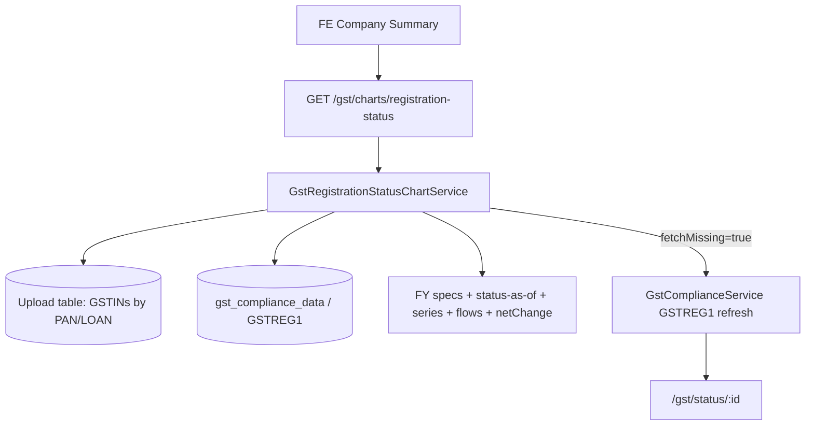

# Registration Status Chart API — Backend Implementation Plan

## Goal

Ship a single backend API for the **Registration Status** Sankey chart so the frontend can show:

- Yearly Active / Cancelled / Suspended counts (and %) at **Company PAN** or **Loan** level
- GSTIN-level **flows** between consecutive FYs (Sankey links)
- Hover **net change** (first FY → last FY in selected range)
- Click **drill-down** to GSTIN rows for a year + status
- **Missing data** popup with Fetch Data / Continue Anyway

Aligned with `Registration status and geographic concentration.docx` § Registration Status.

**Out of scope for this plan:** On-Time Filing Behaviour and Geographic Concentration (same doc — separate plans later).

---

## Current state in this repo

| Piece | Status | Notes |
|-------|--------|--------|
| Tax Payment chart pattern | Done | Reuse: entity resolve, `range`, missing/fetch, slim response |
| `gst_compliance_data` Mongo | Exists | One record per `loanId + gstin`; fields include `status`, `verifyResponse`, `searchResponse` |
| Aggregation Active/Cancelled/Suspended | Exists | `gst-aggregation.service` → `extractGstStatus` (current snapshot only) |
| Yearly GSTREG1 history collection | **Missing** | Sankey needs status **per FY**, not only “today” |
| Chart endpoint | **Not started** | No `/gst/charts/registration-status` yet |

**Implication:** Implementation must (1) define how to derive status **as of each FY**, and (2) mirror Tax Payment’s single-GET + filters pattern.

---

## Product rules (from the doc)

| Rule | Detail |
|------|--------|
| Source | GSTREG1 (registration / search verify data) |
| Aggregation | PAN → all GSTINs; LOAN → all GSTINs on loan (same as Tax Payment) |
| Statuses | `ACTIVE` \| `CANCELLED` \| `SUSPENDED` \| `NULL` (unknown) |
| NULL ≠ Cancelled/Suspended/0 | Missing stays null; do not invent status |
| Time grain | **Yearly only** (no half-year / quarter) |
| Range filter | `1y` \| `3y` \| `5y` (Past 1 / 3 / 5 years) |
| Default UX | 3y Sankey (most readable) |
| Sankey | Track **each GSTIN** FYₙ → FYₙ₊₁ status (not totals only) |
| Net change | Last FY count − first FY count per status (hover) |
| Drill-down | Click e.g. FY23 Active → GSTIN table from GSTREG1 |
| Loan | Same calculation as PAN |

---

## Open decision — status “as of” a financial year

GSTREG1 docs typically expose **current** status + dates (registration / cancellation). They usually do **not** store one row per FY.

**Recommended approach (WP0 must confirm against real `searchResponse` payloads):**

For each GSTIN and FY ending `31 Mar (fyStartYear + 1)`:

1. If no GSTREG1 record → status = `NULL` (missing).
2. Else reconstruct from dates + current status:
   - Before registration date → not in universe for that FY (or NULL — product call).
   - After cancellation effective date → `CANCELLED`.
   - If suspended flags/dates apply in that FY → `SUSPENDED`.
   - Else → `ACTIVE`.
3. Normalize raw strings (`Active`, `ACT`, `Cancelled`, `CNL`, `Suspended`, …) via a shared mapper (reuse / extend `extractGstStatus`).

**Fallback if dates are unreliable:** treat stored `status` as the only known state and apply it to all FYs in range where the GSTIN exists — **document as incomplete Sankey** (flows will understate true history). Prefer date-based reconstruction.

---

## Target API (single endpoint)

```
GET /gst/charts/registration-status
```

Mirror Tax Payment: one call for series + flows + missing + optional drill-down/fetch.

### Query params

| Param | Required | Values | Role |
|-------|----------|--------|------|
| `entityType` | yes | `PAN` \| `LOAN` | Aggregation level |
| `entityId` | yes | PAN or loan id | Entity key |
| `range` | yes | `1y` \| `3y` \| `5y` | Trailing FY window |
| `financialYear` | no | e.g. `2023-24` | Drill-down year |
| `status` | no | `ACTIVE` \| `CANCELLED` \| `SUSPENDED` | Drill-down node |
| `fetchMissing` | no | `true` | Enqueue GSTREG1 refresh jobs |
| `username` / `tableName` | no | — | Fetch identity / upload table |

No `granularity` (always annual).

### Slim response (FE-only fields)

```ts
{
  series: Array<{
    period: string;           // "FY23-24"
    financialYear: string;    // "2023-24"
    active: number | null;
    cancelled: number | null;
    suspended: number | null;
    total: number | null;     // GSTINs with known status that FY
    pctActive: number | null;
    pctCancelled: number | null;
    pctSuspended: number | null;
  }>;
  flows: Array<{
    fromPeriod: string;
    toPeriod: string;
    fromStatus: 'ACTIVE' | 'CANCELLED' | 'SUSPENDED';
    toStatus: 'ACTIVE' | 'CANCELLED' | 'SUSPENDED';
    count: number;            // GSTINs that moved this way
  }>;
  netChange: {
    fromPeriod: string;
    toPeriod: string;
    active: number | null;      // last − first
    cancelled: number | null;
    suspended: number | null;
  } | null;
  incomplete: boolean;
  missing: Array<{
    gstin: string;
    financialYear: string;
  }>;
  drilldown?: {
    period: string;
    financialYear: string;
    status: 'ACTIVE' | 'CANCELLED' | 'SUSPENDED';
    rows: Array<{
      gstin: string;
      status: string;
      // GSTREG1 display fields (legalName, registrationDate, cancellationDate, state, …)
      legalName: string | null;
      registrationDate: string | null;
      cancellationDate: string | null;
      state: string | null;
    }>;
  };
  fetch?: {
    jobs: Array<{ jobId: string; status: string; checkStatusUrl: string }>;
  };
}
```

**Hard rules**

- If a FY has no usable GSTREG1 for any GSTIN → counts/`%` stay `null`, not `0`.
- Flows only include GSTINs with **known** status in both years (NULL endpoints excluded from link counts).
- `incomplete: true` when any expected GSTIN×FY is missing.
- Omit `drilldown` / `fetch` unless requested (same slim pattern as Tax Payment).

---

## Architecture



### Aggregation pipeline

1. Resolve GSTIN units for PAN or LOAN (reuse Tax Payment upload-table resolve).
2. Build trailing FY list from `range` (Indian FY Apr–Mar; end at current FY).
3. Load GSTREG1 / compliance docs for those GSTINs.
4. For each GSTIN × FY → status via WP0 as-of rules.
5. Roll up yearly counts + %.
6. Build Sankey `flows` between consecutive FYs.
7. Compute `netChange` first↔last FY.
8. Collect `missing` (GSTIN + FY with NULL).
9. Optional drill-down / enqueue fetch.

---

## Work packages

### WP0 — Confirm GSTREG1 payload & status-as-of rules

- [ ] Sample real `searchResponse` / verify payloads: status field, registration date, cancellation/suspension dates.
- [ ] Document mapping table: raw `sts` → `ACTIVE` | `CANCELLED` | `SUSPENDED` | `NULL`.
- [ ] Freeze “as of FY end” algorithm; write unit fixtures from real samples.
- [ ] Decide: GSTIN registered mid-FY — include in that FY’s total? (Recommend: yes if registered on or before 31 Mar.)

### WP1 — Shared util: periods, normalize, series, flows

New files (mirror Tax Payment):

- `gst-registration-status-chart.util.ts`
- `gst-registration-status-chart.util.spec.ts`

- [ ] `buildFyPeriodSpecs(range)` → trailing 1 / 3 / 5 FYs.
- [ ] `normalizeRegistrationStatus(raw)`.
- [ ] `statusAsOfFinancialYear(record, fyStartYear)`.
- [ ] `buildYearlySeries(gstins, statusesByGstinFy)`.
- [ ] `buildSankeyFlows(...)` consecutive year transitions.
- [ ] `buildNetChange(series)`.
- [ ] `findMissingRegistrationSlots(...)`.
- [ ] `%` = count / total × 100; null when total is null/0 with no data.

### WP2 — Service + data load

- [ ] `GstRegistrationStatusChartService.getChart(params)`.
- [ ] Reuse PAN/LOAN unit resolve from upload table (extract shared helper from Tax Payment if duplication is painful; otherwise copy minimally).
- [ ] Load from `GstComplianceRecord` (and any future GSTREG1 collection if split later).
- [ ] Register in `gst.module.ts`.

### WP3 — Controller endpoint

- [ ] `GET /gst/charts/registration-status` in `gst.controller.ts`.
- [ ] Same `successResponse('charts.registration-status', data)` wrapper.
- [ ] JSDoc: required/optional params; slim response notes.

### WP4 — Drill-down

- [ ] When `financialYear` + `status` provided → filter GSTINs whose as-of status matches.
- [ ] Return GSTREG1 display fields needed for the table (not full raw payload dumps).

### WP5 — Missing data + fetch

- [ ] `incomplete` + `missing[]` always on chart load.
- [ ] `fetchMissing=true` → enqueue existing GSTIN verify/search (GSTREG1) jobs via compliance pipeline (not GSTR-2B/3B — fix doc copy-paste).
- [ ] Return slim `fetch.jobs` with `checkStatusUrl`.
- [ ] After fetch, FE reloads chart without `fetchMissing`.

### WP6 — Tests

- [ ] Util: FY window for 1y/3y/5y; status normalize; as-of date edge cases; null not coerced to 0; Sankey link counts; net change; missing slots.
- [ ] Service smoke (mocked Mongo + TypeORM): unknown PAN → 400; Mongo off → 503 if applicable.

### WP7 — FE handoff

- [ ] Sample responses for: 3y complete, incomplete+missing, drill-down, fetchMissing.
- [ ] Note: amounts are counts; FE draws Sankey from `series` + `flows`; hover uses `netChange`.

---

## Suggested build order

1. **WP0** — lock GSTREG1 field mapping and as-of rules (blocks everything).
2. **WP1** — pure util + unit tests.
3. **WP2 + WP3** — service + GET endpoint.
4. **WP4** — drill-down.
5. **WP5** — missing / fetch wiring.
6. **WP6 / WP7** — tests + sample payloads for FE.

---

## Acceptance criteria

- [ ] `GET ...?entityType=PAN&entityId=<PAN>&range=3y` returns 3 FY points with Active/Cancelled/Suspended counts + %.
- [ ] `flows` reflect GSTIN-level transitions between consecutive FYs.
- [ ] `netChange` compares first vs last FY in range.
- [ ] Missing GSTREG1 → `incomplete: true`, listed in `missing`, counts stay null where appropriate.
- [ ] Drill-down with `financialYear` + `status` returns matching GSTIN rows.
- [ ] `fetchMissing=true` queues GSTREG1/compliance jobs (not return types).
- [ ] Same behaviour for `entityType=LOAN`.
- [ ] Response stays slim (no graph render metadata / unused ids).

---

## Risks / watchouts

1. **Historical accuracy** — current Mongo store is a snapshot; without dates, Sankey history is weak.
2. **Considered-entity GSTINs** — Tax Payment includes them; confirm product wants them on Registration Sankey.
3. **Fetch fan-out** — many GSTINs × refresh jobs; consider dedupe / batch later.
4. **Doc error** — Fetch Data section mentions GSTR-2B/3B; this chart must refresh **GSTREG1 / compliance search**.
5. **5y Sankey density** — backend still returns yearly series+flows; FE may hide some links for readability.

---

## File checklist

| File | Action |
|------|--------|
| `services/gst-registration-status-chart.util.ts` | Create |
| `services/gst-registration-status-chart.util.spec.ts` | Create |
| `services/gst-registration-status-chart.service.ts` | Create |
| `gst.controller.ts` | Add GET route |
| `gst.module.ts` | Register service |
| Optional: extract `chart-entity-resolve` shared by Tax Payment + this chart | Later refactor |

---

## Example FE usage (after ship)

```bash
# Load 3y Sankey
GET /gst/charts/registration-status?entityType=PAN&entityId=AAACN0255D&range=3y

# Click FY23 Active
GET /gst/charts/registration-status?entityType=PAN&entityId=AAACN0255D&range=3y&financialYear=2023-24&status=ACTIVE

# Fetch missing GSTREG1
GET /gst/charts/registration-status?entityType=PAN&entityId=AAACN0255D&range=3y&fetchMissing=true&username=analyst1
```
