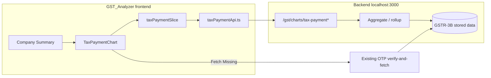

# Tax Payment Chart — Adapted to GST Analyzer

## Reality check vs original plan

| Original plan assumption | This repo |
|---|---|
| Turborepo + Prisma + RabbitMQ + Redis | **Frontend-only** Vite/React app talking to `VITE_API_URL` (`localhost:3000`) |
| Chart lib already in platform | **No chart library** in `package.json` yet |
| Entity tables in schema.prisma | Entities already exist as portfolio Mongo rows: `primary_pan`, `associated_loan_id`, `primary_gst_no` (`DbPortfolioRow`) |
| GSP fetch pipeline | Already exists via OTP + `POST /gst/verify-and-fetch/gstr-3b` + `GET /gst/taxpayer/gstr-3b/:year` |

**Implication:** Prisma tables, RabbitMQ consumer, and Redis caching are **backend work** (outside this repo). This plan covers (1) frontend implementation here, and (2) the exact API contracts the Node backend must expose so the UI can ship.



---

## Placement in the UI

Mount under **Company Summary** in [`CompanyDetails.tsx`](src/components/company/CompanyDetails.tsx) / [`CompanySummary.tsx`](src/components/portfolioView/CompanySummary.tsx).

- Default entity: **PAN** (`customer.primary_pan` / row `primary_pan`)
- Toggle: **Loan** (`associated_loan_id`) — matches existing AggregationTable loan pattern
- Entity GSTIN list already available from `customerRows` (`primary_gst_no`)

Do **not** put this on Consent Data (that screen is per-GSTIN filed-return detail). The chart is a portfolio rollup.

---

## Frontend architecture (match existing patterns)

Mirror how aggregation / OTP are wired today:

| Concern | New files |
|---|---|
| HTTP client | [`src/services/taxPaymentApi.ts`](src/services/taxPaymentApi.ts) — same `API_BASE` / `fetch` style as [`aggregationApi.ts`](src/services/aggregationApi.ts) |
| Redux | [`src/features/taxPayment/taxPaymentSlice.ts`](src/features/taxPayment/taxPaymentSlice.ts) — thunks + status/error/series; register in [`store.ts`](src/app/store.ts) |
| UI | [`src/components/portfolioView/TaxPaymentChart.tsx`](src/components/portfolioView/TaxPaymentChart.tsx) (+ small `MissingDataModal`, `DrilldownPanel`, `RangeSelector`) |
| Styles | Extend [`src/styles/dashboard.css`](src/styles/dashboard.css) with `tax-payment-*` classes (same BEM style as `company-summary-*`) |
| Chart lib | Add **`recharts`** (stacked `Bar` + dotted `Line` on one axis) — none exists today |

### Types (frontend)

```ts
type EntityType = "PAN" | "LOAN";
type RangeKey = "1y" | "3y" | "5y";
type DataStatus = "COMPLETE" | "MISSING" | "PARTIAL";
type Half = "H1" | "H2";

interface TaxPaymentPeriod {
  period: string;           // "H1 FY23-24" or "FY23-24"
  financialYear: string;    // "2023-24"
  half: Half | null;        // null when granularity=annual
  itcUtilised: number | null;
  cashTaxPaid: number | null;
  totalPayments: number | null;
  prevPeriodTotal: number | null;
  pctChangeTotal: number | null;
  pctChangeItc: number | null;
  pctChangeCash: number | null;
  gstinCount: number;
  gstinTotal: number;
  dataStatus: DataStatus;
}

interface TaxPaymentChartResponse {
  granularity: "half-yearly" | "annual";
  series: TaxPaymentPeriod[];
  incomplete: boolean;
}
```

**Hard rule (carry from original plan):** never coerce `null` → `0`. Recharts must treat null as gaps (filter/`connectNulls={false}`). Tooltip shows "—" when `pctChange* === null`.

---

## Backend API contract (for Node at `VITE_API_URL`)

Keep paths under the existing `/gst/...` prefix (not `/api/v1/...`) so they match this app’s other services.

```
GET  /gst/charts/tax-payment
     ?entityType=PAN|LOAN&entityId=...&range=1y|3y|5y

GET  /gst/charts/tax-payment/missing
     ?entityType=...&entityId=...&financialYear=...&half=H1|H2

POST /gst/charts/tax-payment/fetch-missing
     Body: { entityType, entityId, financialYear, half }
     → 202; backend should enqueue GSTR-3B fetch for missing GSTINs
       (same pipeline as Operational Status / verify-and-fetch)

GET  /gst/charts/tax-payment/drilldown
     ?entityType=...&entityId=...&financialYear=...&half=...
```

Response shapes stay as in the original plan (§4), including `incomplete` and per-period `dataStatus`.

### Backend aggregation (outside this repo, but required)

- Source fields already conceptualized in Consent Data: **ITC utilisation** + **tax paid in cash** from stored GSTR-3B (`itc_elg` / `tx_pmt` mapping in [`ConsentData.tsx`](src/components/portfolioView/ConsentData.tsx)).
- Pre-aggregated tables (`GstinTaxPeriod`, `TaxPaymentAggregate`) remain a backend concern; frontend only consumes the chart endpoints.
- If backend is not ready yet: optional **interim** client-side path — load stored GSTR-3B via existing `getStoredGstReturnData("gstr-3b", ...)` per GSTIN × year, sum H1/H2 client-side. Use only as a stopgap; production should use the chart APIs.

---

## Missing-data + Fetch flow (reuse what you have)

1. Chart load → if `incomplete`, open `MissingDataModal` (pattern like OTP modal in Operational Status).
2. **Fetch Data** → prefer `POST /gst/charts/tax-payment/fetch-missing`. If that endpoint is not ready, fall back to existing OTP/`fetchGstReturn` flow for listed missing GSTINs (`gstr-3b`) from [`otpSlice`](src/features/otp/otpSlice.ts).
3. Poll chart GET every few seconds (no websocket in this frontend today) until `incomplete` clears or user dismisses.
4. **Continue Anyway** → dismiss modal; render with PARTIAL/MISSING as greyed/gap segments.

---

## Suggested build order (this repo)

1. Add `recharts` + `taxPaymentApi.ts` types/client (mock or real).
2. `taxPaymentSlice` + register in store.
3. `TaxPaymentChart` shell in Company Summary: range selector + stacked bar/line (1y/3y half-yearly).
4. Tooltip `%` change + null/"—" handling.

5. Drilldown panel (per-GSTIN for a period).
6. Missing-data modal + Fetch/Continue + poll refresh.
7. 5y annual granularity labels + clarify click → H1/H2 sub-view before GSTIN drilldown.
8. Loan vs PAN entity toggle wired from Company Summary props/`customerRows`.

---

## Open items (defaults if unset)

- **Units:** default **₹ Lakhs** in axis/tooltip labels; easy constant to flip to Cr later.
- **5y click:** open inline H1/H2 breakup first, then GSTIN drilldown.
- **Fetch completion:** short polling (3–5s) of chart GET — matches current app (no SSE/websocket).
- **Interim vs real API:** start against real `/gst/charts/tax-payment*` if backend can land endpoints in parallel; otherwise mock the service layer behind the same interface so UI is unblocked.
