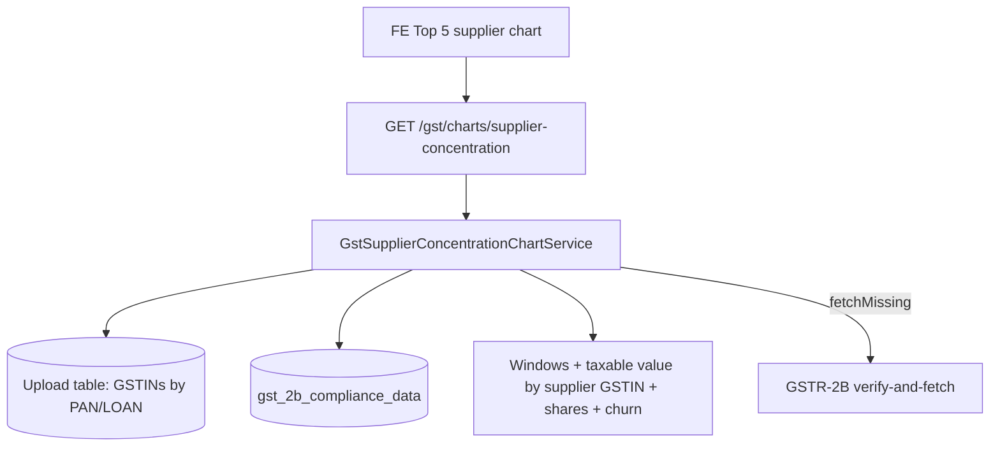

# Supplier Concentration Chart API — Backend Implementation Plan

## Goal

Ship one backend API for **Supplier Concentration** on Company / Loan summary.

The frontend should be able to:

- Show **Top 5 suppliers** by current-period purchase dependency share
- Compare **previous vs current** dependency share and movement
- Open a **supplier table** on chart click (rank, values, shares, status, interpretation)
- Surface **new suppliers**, **attrition** (count + value), and **Top 5 concentration**
- Show **missing GSTR-2B months** with Fetch Data / Continue Anyway
- Use the **same logic at PAN and LOAN** level

Source: `supplier concentration.docx`.

---

## Current state in this repo

| Piece | Status | Notes |
|-------|--------|--------|
| Chart pattern (PAN/LOAN, range, missing/fetch, slim GET) | Done | Tax Payment / Registration / Legal Risk |
| GSTR-2B storage | Exists | Mongo `gst_2b_compliance_data` (`Gstr2bComplianceRecord`) per GSTIN + year + month |
| GSTR-2B invoice walk | Exists | `gst-gstr2b-aggregation.util.ts` — **ITC / supplier count**, not purchase taxable value |
| Fetch 2B | Exists | Tax Payment `fetchMissing` currently queues **GSTR-3B**; 2B verify-and-fetch already exists elsewhere |
| Supplier Concentration endpoint | **Not started** | No `/gst/charts/supplier-concentration` |

This chart is a **two-period comparison**, not a multi-bucket time series like Tax Payment.

---

## Product rules (from the doc)

| Rule | Detail |
|------|--------|
| Chart name | Supplier Concentration |
| First view | Top 5 suppliers: previous share vs current share + movement |
| Rank | Current-period dependency share (desc) |
| Entity | All GSTINs under Company PAN; same for loan |
| Source | **GSTR-2B** invoice / supplier-level data |
| Supplier key | **Supplier GSTIN** (name is display-only) |
| Purchase value | Taxable value of purchases from that supplier, **summed across all company GSTINs** |
| Company total | Σ purchase value of all suppliers in that comparison period (denominator) |
| Dependency share | Supplier purchase value ÷ company total × 100 (per period) |
| Status | `EXISTING` / `NEW` / `LEFT` |
| Top 5 concentration | Σ Top 5 purchase value ÷ company total × 100 (per period) |
| Missing | NULL, not zero purchases. Fetch Data / Continue Anyway |
| Loan | Same calculation |

### Comparison windows

| User selection | Backend `range` | Previous period | Current period |
|----------------|-----------------|-----------------|----------------|
| Past 1 Year | `1y` | First 6 months of the last 12 months | Second 6 months |
| Past 2 years or more | `3y` or `5y` | Prior comparable 12 months | Latest 12 months |

Same windows drive dependency, new suppliers, attrition, and concentration movement.

**Recommendation:** align months to the existing Indian FY calendar already used by Tax Payment (Apr–Mar). For `1y`, current half = latest completed H1/H2 (or include the in-progress half and mark incomplete). For `3y`/`5y`, compare latest FY vs previous FY (not a 3- or 5-year series). `range` only picks **half-year vs annual comparison**, it does not return 3 or 5 chart points.

### Interpretation facts (backend supplies numbers; FE can render EarlySafe copy)

- Top 5 concentration previous vs current (diversifying vs concentrating)
- Dependency increased / decreased / stable per Top 5 supplier
- Active supplier counts + net change
- New supplier count, names/GSTINs, purchase value, new-supplier rate
- Attrition count, attrition value, attrition value share of previous total
- Flags: major-supplier dependency jump; new supplier already in Top 5; material leaver

---

## Open decisions (WP0)

1. **Dependency change formula (doc is inconsistent)**  
   Heading says **percentage points (pp)**; the written formula divides by previous share (relative %).  
   **Plan default:**  
   - `dependencyChangePp` = current share − previous share  
   - `dependencyChangePct` = (current − previous) / previous × 100 when previous share > 0, else `null`  
   Chart movement uses **pp**. Relative % is extra for the table.

2. **Comparison calendar**  
   Rolling last 12 months vs latest completed FY/half.  
   **Plan default:** Tax Payment FY halves (`H1` Apr–Sep, `H2` Oct–Mar). `1y` = last two halves; `3y`/`5y` = last two FYs.

3. **Purchase amount field**  
   Doc: taxable value, not ITC. Confirm GSTR-2B keys (`txval`, `taxable_value`, line vs invoice). Credit notes / amendments: **net** (subtract CDN taxable value) unless product says gross invoices only.

4. **New / left vs net count**  
   Doc sometimes gates New on “count increased” and Left on “count decreased”. Net count can be 0 while both join and leave.  
   **Plan default:** always use set difference (`NEW` = current − previous, `LEFT` = previous − current). Also return net count change. Do not hide leavers when a new supplier offsets them.

5. **New supplier rate / attrition rate** (formulas omitted in the doc)  
   - New supplier rate = new count ÷ previous active count × 100  
   - Attrition rate = left count ÷ previous active count × 100  
   Both `null` when previous active count is 0.

6. **Top 5 ties** — extra suppliers with the same current share: keep a stable sort (share desc, then purchase value desc, then GSTIN) and take 5.

7. **Missing vs zero** — GSTIN-month with no 2B doc → missing. Stored 2B with no invoices → ₹0 for that month (real zero). Do not treat missing months as ₹0 in totals; flag `incomplete`.

8. **Unidentified supplier** (invoice with no `ctin`) — exclude from ranked suppliers; optionally fold into `unallocatedPurchaseValue` so shares still sum toward 100 of identified spend, **or** keep in company total as `"UNKNOWN"`. Default: include in company total, exclude from Top 5 / named table unless GSTIN present.

---

## Target API (single endpoint)

```
GET /gst/charts/supplier-concentration
```

Same pattern as other charts: one GET for summary + missing + optional table + fetch.

### Query params

| Param | Required | Values | Role |
|-------|----------|--------|------|
| `entityType` | yes | `PAN` \| `LOAN` | Aggregation |
| `entityId` | yes | PAN or loan id | Entity |
| `range` | yes | `1y` \| `3y` \| `5y` | Comparison window (see table above) |
| `view` | no | `table` | Chart click → full supplier table |
| `fetchMissing` | no | `true` | Enqueue **GSTR-2B** fetch for missing GSTIN-months |
| `username` / `tableName` | no | — | Fetch identity / upload table |

No quarter/month picker on this chart. No `risk` / `status` slice param; drill-down is the supplier table.

### Slim response

```ts
{
  range: '1y' | '3y' | '5y';
  comparison: {
    previous: { period: string; financialYear: string; half: 'H1' | 'H2' | null };
    current: { period: string; financialYear: string; half: 'H1' | 'H2' | null };
  };
  totals: {
    previousPurchaseValue: number | null;
    currentPurchaseValue: number | null;
    previousActiveSupplierCount: number | null;
    currentActiveSupplierCount: number | null;
    supplierCountChange: number | null;
  };
  concentration: {
    previousTop5Pct: number | null;
    currentTop5Pct: number | null;
    top5ChangePp: number | null;
  };
  churn: {
    newSupplierCount: number | null;
    newSupplierRate: number | null;
    attritionCount: number | null;
    attritionRate: number | null;
    attritionValue: number | null;
    attritionValueShare: number | null; // % of previous company total
  };
  series: Array<{           // Top 5 by current share (first view)
    rank: number;
    supplierGstin: string;
    supplierName: string | null;
    previousPurchaseValue: number | null;
    currentPurchaseValue: number | null;
    previousShare: number | null;
    currentShare: number | null;
    dependencyChangePp: number | null;
    dependencyChangePct: number | null;
    status: 'EXISTING' | 'NEW' | 'LEFT';
  }>;
  interpretation: {
    concentrating: boolean | null;     // current Top5 % > previous
    materialLeavers: Array<{ supplierGstin: string; previousShare: number }>;
    newInTop5: string[];               // GSTINs
  };
  incomplete: boolean;
  missing: Array<{
    gstin: string;
    financialYear: string;
    year: number;
    month: number;
  }>;
  drilldown?: {
    rows: Array<{
      rank: number | null;             // null for LEFT (not in current rank)
      supplierGstin: string;
      supplierName: string | null;
      previousPurchaseValue: number | null;
      currentPurchaseValue: number | null;
      previousShare: number | null;
      currentShare: number | null;
      dependencyChangePp: number | null;
      status: 'EXISTING' | 'NEW' | 'LEFT';
      interpretation: 'INCREASED' | 'DECREASED' | 'STABLE' | 'NEW' | 'LEFT';
    }>;
  };
  fetch?: {
    jobs: Array<{
      jobId: string;
      status: string;
      checkStatusUrl: string;
    }>;
  };
}
```

**Hard rules**

- Shares use that period’s company total as denominator. Missing period total → shares `null`, not 0%.
- First-time / no previous 2B: previous metrics `null`; do not invent 0% movement.
- Top 5 `series` is current-period ranked suppliers (new suppliers can appear; leavers generally do **not** unless we add a separate leavers callout in `interpretation.materialLeavers`).
- `view=table` returns **union** of previous and current suppliers (Existing + New + Left).
- Company totals and shares ignore fake zeros from missing months; `incomplete` is true if any required GSTIN-month is missing.
- Omit `drilldown` / `fetch` unless requested.
- Raw ₹; FE converts to Cr / Lakhs.

### Status and movement labels

| Status | Rule |
|--------|------|
| `NEW` | Purchase value > 0 in current, none in previous |
| `LEFT` | Purchase value > 0 in previous, none in current |
| `EXISTING` | > 0 in both |

| Table `interpretation` | Rule |
|------------------------|------|
| `NEW` / `LEFT` | From status |
| `INCREASED` | `dependencyChangePp` > small epsilon (e.g. 0.5 pp) |
| `DECREASED` | < −epsilon |
| `STABLE` | otherwise (including previous share 0 handled as NEW) |

---

## Architecture



### Pipeline

1. Resolve GSTINs for PAN or LOAN (reuse existing chart entity resolve).
2. From `range`, build previous/current month sets (FY halves or FYs).
3. Load GSTR-2B docs for those GSTINs and months.
4. For each doc, extract supplier GSTIN + taxable value (net of credit notes).
5. Roll up by supplier GSTIN across all company GSTINs per period.
6. Compute company totals, shares, Top 5, concentration, new/left sets, attrition value.
7. Collect missing GSTIN-months → `incomplete` + `missing`.
8. Optional: `view=table` full rows.
9. Optional: enqueue GSTR-2B fetch for missing months.

---

## Work packages

### WP0 — Amounts, windows, 2B payload

- [ ] Confirm taxable-value keys on real `gstr2bResponse` (B2B / B2BA / CDNR / ISD if in scope).
- [ ] Confirm net vs gross (credit notes).
- [ ] Freeze comparison windows vs Tax Payment halves.
- [ ] Define missing month vs empty 2B.

### WP1 — Util

New files:

- `gst-supplier-concentration-chart.util.ts`
- `gst-supplier-concentration-chart.util.spec.ts`

- [ ] `buildComparisonWindows(range, asOfDate)`
- [ ] `extractSupplierPurchases(gstr2bResponse)` → `{ supplierGstin, supplierName, taxableValue }`
- [ ] `rollUpBySupplier(rows)` across GSTINs
- [ ] `dependencyShare(value, total)`
- [ ] `rankTop5(currentMap, previousMap)`
- [ ] `classifyStatus` / movement labels
- [ ] `churnMetrics` (new/left counts, rates, attrition value + share)
- [ ] `top5ConcentrationPct`
- [ ] `findMissing2bMonths(units, months, records)`
- [ ] Null-safe %; never coerce missing → 0

### WP2 — Service + data load

- [ ] `GstSupplierConcentrationChartService.getChart(params)`
- [ ] Reuse entity resolve from upload table
- [ ] Query `Gstr2bComplianceRecord` by loanIds/gstins + year/month
- [ ] Register in `gst.module.ts`

### WP3 — Controller

- [ ] `GET /gst/charts/supplier-concentration`
- [ ] `successResponse('charts.supplier-concentration', data)`
- [ ] JSDoc: two-period comparison; GSTR-2B; `view=table`; fetch is 2B not 3B

### WP4 — Drill-down table

- [ ] `view=table` → all suppliers in either period, ranked by current share (LEFT at end)
- [ ] Columns match the doc table

### WP5 — Missing + fetch

- [ ] `incomplete` + `missing[]` (GSTIN + calendar month)
- [ ] `fetchMissing=true` → **GSTR-2B** jobs (not 3B / not notices)
- [ ] Slim `fetch.jobs`

### WP6 — Tests + FE samples

- [ ] Util: 1y halves; 3y two FYs; share sums; Top 5 rank; NEW/LEFT with net count 0; attrition value; missing ≠ 0
- [ ] Credit-note netting
- [ ] Sample JSON: complete chart, incomplete, table, fetch

---

## Suggested build order

1. WP0 — 2B taxable value + windows  
2. WP1 — util + tests  
3. WP2 + WP3 — service + GET  
4. WP4 — table  
5. WP5 — fetch missing 2B  
6. WP6 — FE samples  

---

## Acceptance criteria

- [ ] `GET ...?entityType=PAN&entityId=<PAN>&range=1y` returns Top 5 with previous/current share and `dependencyChangePp`
- [ ] Rank is by **current** dependency share
- [ ] Purchase values are GSTR-2B taxable value, rolled up by supplier GSTIN across all company GSTINs
- [ ] `range=1y` compares two six-month windows; `range=3y` or `5y` compares two 12-month windows
- [ ] `view=table` includes Existing, New, and Left
- [ ] New/Left always from set difference, even when net supplier count is unchanged
- [ ] GSTIN-month with no 2B → `incomplete` + `missing`, not ₹0
- [ ] Stored empty 2B → ₹0 for that month, not missing
- [ ] `fetchMissing=true` queues GSTR-2B, not GSTR-3B
- [ ] Same behaviour for `entityType=LOAN`
- [ ] Top 5 concentration previous vs current present for EarlySafe copy

---

## Risks

1. 2B aggregation today is ITC-centric; using ITC as “purchase value” would be wrong.
2. Nested 2B JSON varies (Sandbox vs live); extractor must be tested on real `gst_2b_compliance_data`.
3. Incomplete months silently understate a supplier’s share if treated as zero.
4. OTP / verify-and-fetch required for missing 2B.
5. Doc formula for pp vs % can confuse FE; return both with clear names.
6. ISD / import / nil-rated sections may or may not count as “purchases from a supplier GSTIN”.

---

## File checklist

| File | Action |
|------|--------|
| `services/gst-supplier-concentration-chart.util.ts` | Create |
| `services/gst-supplier-concentration-chart.util.spec.ts` | Create |
| `services/gst-supplier-concentration-chart.service.ts` | Create |
| `gst.controller.ts` | Add GET |
| `gst.module.ts` | Register service |
| Reuse `gst-gstr2b-aggregation.util.ts` traversal | Extend or wrap for `txval` — do not replace ITC metrics |

---

## Example FE usage

```bash
# Past 1 year: two halves, Top 5 chart
GET /gst/charts/supplier-concentration?entityType=PAN&entityId=AAACN0255D&range=1y

# Annual comparison (2+ years selection)
GET /gst/charts/supplier-concentration?entityType=LOAN&entityId=LN000001&range=3y

# Chart click → supplier table
GET /gst/charts/supplier-concentration?entityType=PAN&entityId=AAACN0255D&range=1y&view=table

# Fetch missing GSTR-2B months
GET /gst/charts/supplier-concentration?entityType=PAN&entityId=AAACN0255D&range=1y&fetchMissing=true&username=analyst1
```
