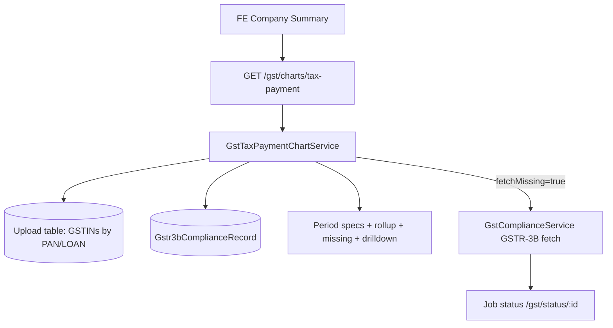

# Tax Payment Graph API — Implementation Plan

## Goal

Ship `GET /gst/charts/tax-payment` so the frontend can render the Tax Payment chart (stacked ITC Utilised + Cash Tax Paid, dotted Total) at **Company PAN** or **Loan** level, with range, drill-down, missing-data, and fetch-missing support per `charts logic (1).docx`.

---

## Current state (already in this repo)

| Piece | Status | Location |
|-------|--------|----------|
| Endpoint | Wired | `gst.controller.ts` → `GET /gst/charts/tax-payment` |
| Service | WIP | `gst-tax-payment-chart.service.ts` |
| Period / rollup utils + unit tests | WIP | `gst-tax-payment-chart.util.ts` (+ `.spec.ts`) |
| Module registration | Done | `gst.module.ts` |
| 3B metrics source | Exists | `computePrimaryGstr3bAggregationMetrics` |

**What already works conceptually**

- Entity resolve: `PAN` / `LOAN` → GSTINs from upload table (`primary` + `considered_entity`)
- Ranges: `1y` / `3y` / `5y` with default granularity half-yearly (1y/3y) or annual (5y)
- Optional overrides: `monthly` / `quarterly` / `half-yearly` / `annual`
- Series rollup + `%` change (total / ITC / cash); first period → `null` (not fake `0%`)
- Missing slots + `incomplete` flag
- Drill-down via `financialYear` (+ `half`/`quarter`) or `year`+`month`
- `fetchMissing=true` enqueues GSTR-2B/3B verify-and-fetch jobs

---

## Spec alignment (doc vs WIP) — decide before finishing

| Topic | Charts logic doc | Current WIP | Plan recommendation |
|-------|------------------|-------------|---------------------|
| Data source | **GSTR-3B only** (ITC Utilised + Cash) | Also loads **GSTR-2B** `eligibleItc`; COMPLETE needs both | **Align to doc: GSTR-3B only** for this chart |
| Totals | ITC + Cash; sum IGST+CGST+SGST+**CESS** | IGST+CGST+SGST only (no CESS in 3B util) | Add CESS into utilised + cash totals |
| API shape | Series + missing + drill-down + fetch | Single GET with query flags | Keep single GET (matches FE contract); no need for 4 separate routes |
| Units | ₹ Cr on Y-axis | Raw ₹ numbers | Return raw ₹; FE converts to Cr/Lakhs |
| Loan level | Same rules | Implemented via `associated_loan_id` | Keep |

**Open product choice:** if FE already expects `eligibleItc`, either (a) drop it to match the doc, or (b) keep as optional extra series. Default for this plan: **(a) GSTR-3B only**.

---

## Target API contract

```
GET /gst/charts/tax-payment
```

### Query params

| Param | Required | Values |
|-------|----------|--------|
| `entityType` | yes | `PAN` \| `LOAN` |
| `entityId` | yes | PAN or loan id |
| `range` | yes | `1y` \| `3y` \| `5y` |
| `granularity` | no | default: half-yearly (1y/3y), annual (5y) |
| `financialYear` | no | e.g. `2023-24` → drill-down |
| `half` | no | `H1` \| `H2` |
| `quarter` | no | `Q1`…`Q4` |
| `year` + `month` | no | monthly drill-down |
| `fetchMissing` | no | `true` → enqueue GSTR-3B jobs for missing months |
| `tableName` / `username` | no | upload table + fetch identity |

### Response (backend → FE)

```ts
{
  entityType, entityId, range, granularity,
  series: [{
    period, financialYear, half, quarter?,
    itcUtilised, cashTaxPaid, totalPayments,  // null when missing
    prevPeriodTotal,
    pctChangeTotal, pctChangeItc, pctChangeCash,  // null for first / undefined prev
    gstinCount, gstinTotal,
    dataStatus: 'COMPLETE' | 'PARTIAL' | 'MISSING'
  }],
  incomplete: boolean,
  missing: [{ gstin, loanId, customerId, financialYear, half?, year, month, returnType: 'GSTR-3B' }],
  missingCount,
  drilldown: null | { period, financialYear, half?, rows: GstinContribution[] },
  fetch: null | { message, monthsQueued, jobs: [{ jobId, status, checkStatusUrl }] }
}
```

**Hard rules**

1. Never coerce missing → `0`. `0` only when 3B exists and value is zero.
2. `totalPayments = itcUtilised + cashTaxPaid` only when **both** sides are non-null; else `null`.
3. Incomplete series still returned when user continues anyway (`incomplete: true` + `missing[]`).

---

## Architecture



### Aggregation pipeline

1. Resolve GSTIN units for PAN or LOAN (primary + considered).
2. Build period specs from `range` + `granularity` (Indian FY: H1 Apr–Sep, H2 Oct–Mar).
3. Load monthly 3B docs for those GSTINs × months.
4. Per GSTIN × month extract:
   - `itcUtilised` = sum IGST+CGST+SGST+CESS utilised (`tx_pmt.pditc`)
   - `cashTaxPaid` = sum IGST+CGST+SGST+CESS cash (`tx_pmt.pdcash`)
5. Roll up to period bucket (sum across GSTINs × months in bucket).
6. Attach previous-period totals and `%` changes.
7. Build `missing` list (expected month × GSTIN with no 3B).
8. Optionally build drill-down / enqueue fetches.

---

## Work packages

### WP1 — Align metrics to doc (GSTR-3B + CESS)

- [ ] Stop treating GSTR-2B as required for Tax Payment completeness.
- [ ] Remove (or make optional) `eligibleItc` / `pctChangeEligibleItc` from chart response if product chooses doc-only.
- [ ] Extend `gst-gstr3b-aggregation.util` to include **CESS** in utilised + cash totals (`csamt` / `cs_pdi` / cess cash fields — confirm against stored payload shape).
- [ ] Update `hasGstr3b` / `findMissingSlots` / `buildChartSeries` COMPLETE logic → **3B only**.
- [ ] `fetchMissing` → enqueue **GSTR-3B only** (drop 2B jobs for this endpoint).

### WP2 — Harden series & missing semantics

- [ ] Confirm PARTIAL vs MISSING rules:
  - COMPLETE: all expected GSTIN×months have 3B
  - PARTIAL: some present
  - MISSING: none present for the bucket
- [ ] Future months in current H1/H2 excluded via `filterMonthsUpTo` (already present — keep).
- [ ] Ensure loan-level sums all GSTINs across companies on that loan (already via upload rows).

### WP3 — Drill-down contract for FE

Doc: bar click → GSTIN contribution; 5y annual → H1/H2 breakup then GSTIN.

- [ ] Keep query-param drill-down on same GET (already implemented).
- [ ] Document FE sequence:
  1. Main series (`range=5y` → annual)
  2. Click FY → `financialYear=YYYY-YY` without half → annual GSTIN rows **or** call twice with `half=H1` / `H2`
  3. Prefer returning H1+H2 sub-buckets when drill-down is annual (small enhancement if FE needs one call)

**Enhancement (optional):** when `financialYear` set and `half` omitted on annual view, return `drilldown.halves: [H1, H2]` each with GSTIN rows.

### WP4 — Fetch-missing + Operational Status

- [ ] Keep `fetchMissing=true` returning job ids + `/gst/status/:id`.
- [ ] Scope fetch to missing months in selected range (or drill-down period if provided) — already partially done.
- [ ] Deduplicate jobs by `year|month` (already done).
- [ ] FE: modal Fetch Data | Continue Anyway; Fetch → this flag or Operational Status; Continue → render with `incomplete`.

### WP5 — Tests

- [ ] Util tests (exist): period specs, null handling, `%` change, missing slots.
- [ ] Add cases: CESS included in totals; COMPLETE without 2B; PARTIAL with one GSTIN missing.
- [ ] Service-level tests (mocked Mongo + TypeORM): PAN resolve, LOAN resolve, empty entity → 400, Mongo off → 503.
- [ ] Smoke: controller returns `successResponse('charts.tax-payment', data)`.

### WP6 — Docs / FE handoff

- [ ] Update controller JSDoc to match final 3B-only contract.
- [ ] Share example responses for 1y half-yearly, 5y annual, incomplete+missing, drill-down, fetchMissing.
- [ ] Confirm axis unit with FE (Cr vs Lakhs) — API stays in ₹.

---

## Suggested build order

1. **Freeze contract** — 3B-only vs keep eligibleItc (recommend 3B-only).
2. **CESS in 3B aggregation** + chart util COMPLETE/missing on 3B only.
3. **Strip 2B from** `loadMonthlyPayments` / fetch path for this API.
4. **Optional annual→H1/H2 drill-down enrichment**.
5. **Service tests** + fix any PAN/LOAN edge cases.
6. **Manual smoke** against real Mongo 3B docs for a known PAN.
7. Hand off sample payloads to FE (Company Summary Tax Payment chart).

---

## Out of scope (this API)

- Frontend Recharts / Redux (separate FE plan: `src/tax_payment_chart_285ca78c.plan.md`)
- Revenue Momentum / Filing Behaviour / GVA charts
- Pre-aggregated SQL/Redis cache (nice-to-have later if latency becomes an issue)
- Auth/RBAC changes beyond existing GST module patterns

---

## Acceptance criteria

- [ ] `GET ...?entityType=PAN&entityId=<PAN>&range=3y` returns 6 half-year bars with ITC, Cash, Total.
- [ ] `range=5y` returns 5 annual points by default.
- [ ] Missing GSTIN×month → `incomplete: true`, listed in `missing`, values stay `null` (not 0).
- [ ] `%` change null on first period; correct formula thereafter.
- [ ] Drill-down returns GSTIN-wise ITC / Cash / Total for selected period.
- [ ] `fetchMissing=true` queues GSTR-3B jobs and returns poll URLs.
- [ ] Same behaviour for `entityType=LOAN`.
- [ ] Unit tests green for util + critical service paths.

---

## Risks / watchouts

1. **CESS fields** in stored 3B JSON may use different keys — verify against real payloads before merging.
2. **Considered-entity GSTINs** inflate company totals; confirm product wants them in PAN chart (current code includes them).
3. **Fetch fan-out** for many missing months can spawn many jobs — consider capping or batching later.
4. FE plan historically assumed separate `/missing` and `/drilldown` routes; backend uses **one GET** — FE should call the single endpoint with query flags.
